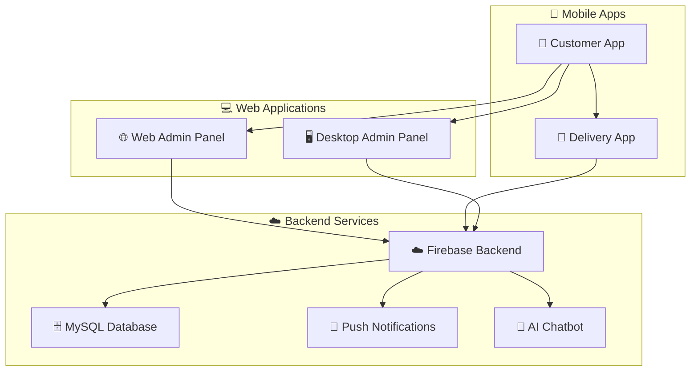

<div align="center">

# 🛒 **DaleLook E-Commerce Ecosystem**


**A Complete Multi-Platform E-Commerce Solution with Advanced Features**

[](https://github.com/oiu85)
[](LICENSE)
[]()
[]()

</div>

---

## 🌟 **Project Overview**

**DaleLook** is a comprehensive e-commerce ecosystem consisting of **4 interconnected applications** designed to provide a complete online shopping experience. Built with modern technologies and following clean architecture principles, this project showcases advanced Flutter development with real-time features, AI integration, and multi-platform support.

### 🎯 **Mission Statement**
To revolutionize the e-commerce experience by providing a seamless, intelligent, and user-friendly platform that connects customers, delivery personnel, and administrators in one unified ecosystem.

---

## 🏗️ **System Architecture**



---

## 📱 **Applications Overview**

### 1. 🛒 **Customer Mobile App** (Flutter)
**Primary shopping interface for end users**

#### ✨ **Key Features**
- 🏠 **Smart Home Dashboard** with personalized recommendations
- 🛍️ **Advanced Product Catalog** with categories and subcategories
- 🔍 **Intelligent Search** with real-time suggestions
- 🛒 **Shopping Cart** with persistent storage
- 💳 **Secure Checkout** with multiple payment options
- 📍 **Location Services** with Google Maps integration
- ❤️ **Wishlist & Favorites** management
- 📱 **Push Notifications** for order updates
- 🤖 **AI-Powered Chatbot** for customer support
- 🌍 **Multi-language Support** (Arabic/English)
- 🎨 **Dark/Light Theme** support
- 📊 **Order Tracking** with real-time updates
- ⭐ **Rating & Review** system
- 💬 **Live Chat** with support team

---

### 2. 🚚 **Delivery Personnel App** (Flutter)
**Dedicated app for delivery drivers and logistics**

#### ✨ **Key Features**
- 📋 **Order Management** dashboard
- 🗺️ **Route Optimization** with Google Maps
- 📍 **Real-time Location Tracking**
- 📞 **Customer Communication** tools
- 📸 **Photo Verification** for deliveries
- 💰 **Earnings Tracking** and reports
- 🔔 **Order Notifications** and alerts
- 📊 **Performance Analytics**
- 🚨 **Emergency Contact** system
- 📱 **Offline Mode** for poor connectivity areas

---

### 3. 🖥️ **Web Admin Control Panel** (Flutter Web)
**Comprehensive web-based administration interface**

#### ✨ **Key Features**
- 📊 **Analytics Dashboard** with real-time metrics
- 👥 **User Management** (customers, delivery personnel)
- 📦 **Product Management** with bulk operations
- 📋 **Order Management** with status tracking
- 💰 **Financial Reports** and analytics
- 🎯 **Marketing Tools** and promotions
- 📱 **Push Notification** management
- 🔧 **System Settings** and configuration
- 📈 **Sales Analytics** and insights
- 🛡️ **Security Management** and access control

---

### 4. 🖥️ **Desktop Admin Panel** (Flutter Desktop)
**Native desktop application for advanced administration**

#### ✨ **Key Features**
- 🖥️ **Native Desktop Experience** with system integration
- 📊 **Advanced Analytics** with custom dashboards
- 🔧 **System Configuration** and maintenance
- 📱 **Mobile App Management** tools
- 🗄️ **Database Administration** interface
- 📈 **Custom Reports** generation
- 🔐 **Advanced Security** features
- ⚡ **High Performance** for large datasets

---

## 🛠️ **Technology Stack**

### 📱 **Frontend Technologies**
- **Flutter 3.5.4** - Cross-platform UI framework
- **Dart 3.5.4** - Programming language
- **GetX** - State management and dependency injection
- **Material Design 3** - Modern UI components
- **Responsive Design** - Multi-screen support

### 🔧 **Backend Technologies**
- **PHP** - Server-side scripting
- **MySQL** - Relational database
- **Firebase** - Real-time database and authentication
- **RESTful APIs** - Communication layer
- **JSON** - Data exchange format

### 🌐 **Cloud & Services**
- **Firebase Authentication** - User management
- **Firebase Cloud Messaging** - Push notifications
- **Firebase Firestore** - Real-time database
- **Google Maps API** - Location services
- **Google Generative AI** - Chatbot intelligence

---

## 🚀 **Getting Started**

### 📋 **Prerequisites**
- Flutter SDK (3.5.4 or higher)
- Dart SDK (3.5.4 or higher)
- Android Studio / VS Code
- Git
- Firebase project setup
- PHP server (XAMPP/WAMP/LAMP)

### 🔧 **Installation Steps**

1. **Clone the repository**
   ```bash
   git clone https://github.com/oiu85/ecommerce_app.git
   cd ecommerce_app
   ```

2. **Install dependencies**
   ```bash
   flutter pub get
   ```

3. **Configure Firebase**
   - Create a Firebase project
   - Download `google-services.json` for Android
   - Download `GoogleService-Info.plist` for iOS
   - Place files in respective platform folders

4. **Configure API endpoints**
   - Update `lib/linkapi.dart` with your server URL
   - Set up your PHP backend server
   - Configure database connections

5. **Run the application**
   ```bash
   # For Android
   flutter run
   
   # For iOS
   flutter run -d ios
   
   # For Web
   flutter run -d web
   ```

---

## 📁 **Project Structure**

```
ecommerce_app/
├── 📱 lib/
│   ├── 🎯 core/                    # Core functionality
│   │   ├── class/                  # Base classes
│   │   ├── constant/               # App constants
│   │   ├── functions/              # Utility functions
│   │   ├── localization/           # Multi-language support
│   │   ├── middleware/             # Route middleware
│   │   └── services/               # Core services
│   ├── 🎮 controller/              # Business logic controllers
│   │   ├── auth/                   # Authentication controllers
│   │   ├── cart_controller.dart    # Shopping cart logic
│   │   ├── home_controller.dart    # Home screen logic
│   │   └── ...                     # Other feature controllers
│   ├── 📊 data/                    # Data layer
│   │   ├── datasource/             # API data sources
│   │   └── model/                  # Data models
│   ├── 🎨 view/                    # UI layer
│   │   ├── screeen/                # App screens
│   │   │   ├── auth/               # Authentication screens
│   │   │   ├── home/               # Home screens
│   │   │   └── ...                 # Other screens
│   │   └── widget/                 # Reusable widgets
│   ├── 🔗 binding/                 # Dependency injection
│   ├── 🛣️ routes.dart              # App routing
│   └── 🚀 main.dart                # App entry point
├── 🎨 assets/                      # App assets
│   ├── fonts/                      # Custom fonts
│   ├── images/                     # App images
│   └── lottie/                     # Animation files
├── 🤖 android/                     # Android configuration
├── 🍎 ios/                         # iOS configuration
├── 🌐 web/                         # Web configuration
└── 📄 pubspec.yaml                 # Dependencies
```

---

## ✨ **Key Features Deep Dive**

### 🛒 **E-Commerce Features**
- **Product Catalog**: Hierarchical categories with subcategories
- **Advanced Search**: Real-time search with filters and sorting
- **Shopping Cart**: Persistent cart with offline support
- **Wishlist**: Save favorite products for later
- **Order Management**: Complete order lifecycle tracking
- **Payment Integration**: Multiple payment gateway support
- **Coupon System**: Discount codes and promotional offers

### 📍 **Location & Delivery**
- **Google Maps Integration**: Interactive maps for location selection
- **Real-time Tracking**: Live order tracking for customers
- **Route Optimization**: Efficient delivery route planning
- **Geofencing**: Location-based notifications and features
- **Address Management**: Multiple saved addresses per user

### 🤖 **AI & Automation**
- **Smart Chatbot**: AI-powered customer support using Google Generative AI
- **Recommendation Engine**: Personalized product suggestions
- **Predictive Analytics**: Sales forecasting and inventory management
- **Automated Notifications**: Smart notification scheduling

### 🔔 **Communication**
- **Push Notifications**: Real-time order updates and promotions
- **In-app Chat**: Direct communication with support team
- **Email Notifications**: Order confirmations and updates
- **SMS Integration**: Critical order updates via SMS

### 🌍 **Internationalization**
- **Multi-language Support**: Arabic and English
- **RTL Support**: Right-to-left text direction for Arabic
- **Localized Content**: Region-specific product catalogs
- **Currency Support**: Multiple currency options

---

## 🔐 **Security Features**

### 🛡️ **Authentication & Authorization**
- **Firebase Authentication** - Secure user management
- **JWT Tokens** - Secure API communication
- **Role-based Access** - Different access levels for users
- **Session Management** - Secure session handling

### 🔒 **Data Protection**
- **Data Encryption** - Sensitive data encryption
- **Secure APIs** - HTTPS communication
- **Input Validation** - Server-side data validation
- **SQL Injection Prevention** - Parameterized queries

---

## 🚀 **Deployment Guide**

### 📱 **Mobile App Deployment**

#### Android (Google Play Store)
1. Generate signed APK/AAB
2. Create Play Console account
3. Upload app bundle
4. Configure store listing
5. Submit for review

#### iOS (App Store)
1. Configure Xcode project
2. Set up provisioning profiles
3. Archive and upload to App Store Connect
4. Configure app metadata
5. Submit for review

### 🌐 **Web Deployment**
1. Build web version: `flutter build web --release`
2. Deploy to hosting service (Firebase Hosting, Netlify, Vercel)
3. Configure custom domain
4. Set up SSL certificate

---

## 🤝 **Contributing**

We welcome contributions from the community! Here's how you can help:

### 🚀 **Getting Started**
1. Fork the repository
2. Create a feature branch: `git checkout -b feature/amazing-feature`
3. Make your changes
4. Commit your changes: `git commit -m 'Add amazing feature'`
5. Push to the branch: `git push origin feature/amazing-feature`
6. Open a Pull Request

### 📋 **Contribution Guidelines**
- Follow the existing code style and patterns
- Write tests for new features
- Update documentation when needed
- Ensure all tests pass
- Follow the commit message convention

---

## 📄 **License**

This project is licensed under the MIT License - see the [LICENSE](LICENSE) file for details.

### 📜 **MIT License Summary**
- ✅ Commercial use allowed
- ✅ Modification allowed
- ✅ Distribution allowed
- ✅ Private use allowed
- ❌ No liability or warranty provided

---

## 📞 **Support & Contact**

### 🆘 **Getting Help**
- **Documentation**: Check this README and inline code comments
- **Issues**: Create an issue on GitHub for bugs or questions
- **Discussions**: Use GitHub Discussions for general questions

### 👨‍💻 **Developer Information**
- **Lead Developer**: [Abdullah Alatrash](https://github.com/oiu85)
- **Experience**: 2+ years Flutter development
- **Specialties**: Firebase, PHP, Laravel API integration
- **Location**: Saudi Arabia

### 🔗 **Social Links**
- **GitHub**: [@oiu85](https://github.com/oiu85)
- **GitLab**: [@love14144.mn](https://gitlab.com/love14144.mn)
- **Facebook**: [Abdullah Alatrash](https://www.facebook.com/share/18p8PYoVDw/)
- **Instagram**: [@85oiu](https://www.instagram.com/85oiu?igsh=MTF3bTR3ZWNveDEzYg==)

---

## 🏆 **Acknowledgments**

### 👥 **Special Thanks**
- **Flutter Team** for the amazing framework
- **Firebase Team** for the robust backend services
- **Google Maps Team** for location services
- **Open Source Community** for excellent packages
- **Beta Testers** for valuable feedback

### 📚 **Resources**
- [Flutter Documentation](https://docs.flutter.dev/)
- [Dart Language Tour](https://dart.dev/guides/language/language-tour)
- [Firebase Documentation](https://firebase.google.com/docs)
- [GetX Documentation](https://github.com/jonataslaw/getx)

---

<div align="center">

**Made with ❤️ by [Abdullah Alatrash](https://github.com/oiu85)**

[](https://github.com/oiu85)
[](https://gitlab.com/love14144.mn)
[](https://flutter.dev)
[](https://firebase.google.com)

**⭐ Star this repository if you found it helpful!**

*Show your support by starring ⭐ this repository and following me on GitHub!*

</div>

---

<div align="center">

### 🚀 **Ready to revolutionize your e-commerce experience?**

**Get started today and join thousands of satisfied users!**

[]()
[]()
[]()

</div>
