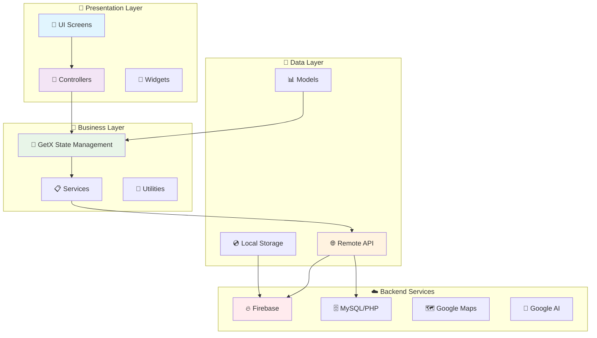

<div align="center">

# 🏥 **PharmaMed E-Commerce Flutter App**

<!-- 


 -->

[](https://flutter.dev)
[](https://dart.dev)
[](https://firebase.google.com)
[](https://php.net)
[](https://mysql.com)
[](https://github.com/jonataslaw/getx)

## 🚀 **A Complete Pharmacy E-Commerce Solution**

**Modern, Scalable, and Feature-Rich Flutter Application for Pharmaceutical Sales & Management**

[](https://github.com/oiu85/Ecommerce-flutter-app-Pharmacy)
[](LICENSE)
[]()
[]()

</div>

---

## 🎯 **Project Overview**

**PharmaMed** is a comprehensive pharmacy e-commerce application built with Flutter that provides a complete solution for online medicine sales, prescription management, and healthcare services. The app features modern UI/UX design, real-time functionality, AI-powered chatbot, multi-language support, and robust backend integration.

### 🌟 **Key Highlights**
- 🏥 **Pharmacy-Specific Features** - Prescription handling, medical info management
- 🤖 **AI Chatbot Integration** - Google Generative AI for customer support
- 🌍 **Bilingual Support** - Arabic & English with RTL support
- 📱 **Cross-Platform** - Android, iOS, and Web support
- 🔐 **Secure Authentication** - Firebase Auth with multiple login methods
- 📍 **Location Services** - Google Maps integration for delivery
- 💳 **Payment Processing** - Multiple payment methods support
- 🔔 **Real-time Notifications** - Firebase Cloud Messaging

---

## 🏗️ **Architecture Overview**

<div align="center">



</div>

---

## ✨ **Core Features**

### 🏥 **Pharmacy Management**
- **📋 Prescription Handling** - Upload and manage prescription requirements
- **💊 Medicine Catalog** - Comprehensive medicine database with categories
- **📊 Medical Info Management** - Store user medical history and allergies
- **🔄 Inventory Tracking** - Real-time stock management
- **⚕️ SubCategory Organization** - Organized medicine classification

### 🛒 **E-Commerce Features**
- **🔍 Smart Search** - Real-time product search with filters
- **🛍️ Shopping Cart** - Persistent cart with offline support
- **❤️ Wishlist Management** - Save favorite medicines
- **🎫 Coupon System** - Discount codes and promotional offers
- **💳 Multiple Payment Methods** - Cash on delivery, bank transfer
- **🚚 Delivery Options** - Home delivery or pharmacy pickup

### 🗺️ **Location & Delivery**
- **📍 Address Management** - Save multiple delivery addresses
- **🗺️ Google Maps Integration** - Interactive location selection
- **🚚 Real-time Tracking** - Order delivery tracking
- **📱 GPS Services** - Location-based services

### 🤖 **AI & Automation**
- **💬 AI Chatbot** - Google Generative AI integration for customer support
- **🔔 Smart Notifications** - Context-aware push notifications
- **📊 Order Management** - Automated order status updates

### 🌍 **Localization & Accessibility**
- **🔤 Multi-language Support** - Arabic & English
- **↩️ RTL Support** - Right-to-left text direction
- **🎨 Custom Fonts** - Cairo & Playfair Display fonts
- **♿ Accessibility** - Screen reader and accessibility features

---

## 🛠️ **Technology Stack**

### **Frontend Technologies**
```yaml
Framework: Flutter 3.5.4
Language: Dart 3.5.4
State Management: GetX
UI Components: Material Design 3
Navigation: GetX Navigation
```

### **Backend & Services**
```yaml
Authentication: Firebase Auth
Database: 
  - Firebase Firestore (Real-time)
  - MySQL (Primary database)
Backend: PHP RESTful APIs
Push Notifications: Firebase Cloud Messaging
Maps: Google Maps API
AI: Google Generative AI
```

### **Key Dependencies**
```yaml
flutter:
  sdk: flutter
firebase_core: ^latest
firebase_auth: ^latest
get: ^latest
http: ^1.2.2
cached_network_image: ^3.2.0
google_maps_flutter: ^2.12.1
firebase_messaging: ^15.1.6
google_generative_ai: ^0.2.0
sqflite: ^2.0.2
shared_preferences: ^2.0.15
geolocator: ^13.0.2
lottie: ^3.2.0
```

---

## 📁 **Project Structure**

```
lib/
├── 🎯 core/
│   ├── class/                    # Base classes and status handling
│   ├── constant/                 # App constants, colors, routes
│   ├── functions/                # Utility functions
│   ├── localization/             # Multi-language support
│   ├── middleware/               # Route middleware
│   └── services/                 # Core services
├── 🎮 controller/                # Business logic controllers
│   ├── auth/                     # Authentication controllers
│   ├── address/                  # Address management
│   ├── orders/                   # Order management
│   ├── cart_controller.dart      # Shopping cart logic
│   ├── home_controller.dart      # Home screen logic
│   ├── checkout_controller.dart  # Checkout process
│   ├── gemini_controller.dart    # AI chatbot
│   └── ...
├── 📊 data/
│   ├── datasource/               # Remote API data sources
│   └── model/                    # Data models (Items, Orders, Cart, etc.)
├── 🎨 view/
│   ├── screeen/                  # App screens
│   │   ├── auth/                 # Login, Signup, Verification
│   │   ├── orders/               # Order management screens
│   │   ├── address/              # Address management
│   │   ├── home.dart             # Main home screen
│   │   ├── cart.dart             # Shopping cart
│   │   ├── checkout.dart         # Checkout process
│   │   └── ...
│   └── widget/                   # Reusable UI components
├── 🔗 binding/                   # Dependency injection setup
├── 🛣️ routes.dart               # App routing configuration
└── 🚀 main.dart                  # Application entry point
```

---

## 🚀 **Getting Started**

### **Prerequisites**
- Flutter SDK 3.5.4 or higher
- Dart SDK 3.5.4 or higher
- Android Studio / VS Code with Flutter extensions
- Firebase project setup
- PHP server environment (XAMPP/WAMP/LAMP)

### **Installation**

1. **Clone the repository**
   ```bash
   git clone https://github.com/oiu85/Ecommerce-flutter-app-Pharmacy.git
   cd Ecommerce-flutter-app-Pharmacy
   ```

2. **Install dependencies**
   ```bash
   flutter pub get
   ```

3. **Firebase Setup**
   ```bash
   # Android
   # Place google-services.json in android/app/
   
   # iOS  
   # Place GoogleService-Info.plist in ios/Runner/
   ```

4. **Configure API endpoints**
   ```dart
   // Update lib/linkapi.dart with your server URL
   static const String server="http://your-server-url/ecommerce";
   ```

5. **Run the application**
   ```bash
   flutter run
   ```

### **Build Commands**
```bash
# Android Debug
flutter build apk --debug

# Android Release
flutter build apk --release

# iOS
flutter build ios --release

# Web
flutter build web --release
```

---

## 📱 **App Screenshots**

<div align="center">

### 🔐 Authentication Flow
| Login Screen | Signup Screen | Verification |
|:---:|:---:|:---:|
|  |  |  |

### 🏠 Main App Features
| Home Screen | Product Details | Shopping Cart |
|:---:|:---:|:---:|
|  |  |  |

### 📋 Order Management
| Checkout | Orders | Tracking |
|:---:|:---:|:---:|
|  |  |  |

</div>

---

## 🌟 **Key Features Deep Dive**

### 🏥 **Pharmacy-Specific Features**

#### **Prescription Management**
- Upload prescription images
- Prescription verification system
- Prescription-only medicine handling
- Medical information form during checkout

#### **Medical Information System**
- User medical profile management
- Chronic diseases tracking
- Current medications tracking
- Allergies and blood type storage
- Height, weight, and age tracking

#### **Medicine Organization**
- Hierarchical category system
- Subcategory classification
- Scientific formula tracking
- Stock availability status
- Discount and pricing management

### 🛒 **Advanced E-Commerce**

#### **Smart Shopping Experience**
```dart
// Example: Cart Management
class CartController extends GetxController {
  List<CartModel> data = [];
  double priceorders = 0.0;
  
  add(String itemsid) async {
    // Add item to cart with validation
  }
  
  applyCoupon() async {
    // Coupon validation and discount calculation
  }
}
```

#### **Order Management Flow**
1. **Cart Review** → 2. **Address Selection** → 3. **Payment Method** → 4. **Medical Info** → 5. **Order Confirmation** → 6. **Real-time Tracking**

### 🤖 **AI Integration**

#### **Smart Chatbot**
```dart
class ChatBotGeminiController extends GetxController {
  Future<void> sendMessage(String text) async {
    // Google Generative AI integration
    // Context-aware responses for pharmacy queries
    // Medical information assistance
  }
}
```

---

## 🔐 **Security & Best Practices**

### **Authentication Security**
- Firebase Authentication with email/password
- Phone number verification
- JWT token management
- Secure session handling

### **Data Protection**
- API request validation
- Input sanitization
- Secure data transmission (HTTPS)
- Local data encryption

### **Privacy Compliance**
- Medical information encryption
- GDPR compliance for EU users
- Secure prescription handling
- Data retention policies

---

## 🚀 **Performance Optimizations**

### **App Performance**
- Lazy loading for large lists
- Image caching with `cached_network_image`
- Efficient state management with GetX
- Memory optimization for large datasets

### **API Optimization**
- Request/response caching
- Offline data storage with SQLite
- Network request optimization
- Background data synchronization

---

## 🧪 **Testing Strategy**

### **Unit Testing**
```bash
flutter test test/unit/
```

### **Widget Testing**
```bash
flutter test test/widget/
```

### **Integration Testing**
```bash
flutter test integration_test/
```

---

## 📊 **Analytics & Monitoring**

### **Firebase Analytics**
- User behavior tracking
- Screen view analytics
- Feature usage statistics
- Crash reporting

### **Performance Monitoring**
- App startup time tracking
- Memory usage monitoring
- Network performance metrics
- Error rate tracking

---

## 🚀 **Deployment**

### **Android Release**
```bash
# Generate signed APK
flutter build apk --release

# Generate App Bundle (recommended)
flutter build appbundle --release
```

### **iOS Release**
```bash
# Generate iOS build
flutter build ios --release

# Archive in Xcode for App Store submission
```

### **Web Deployment**
```bash
# Build for web
flutter build web --release

# Deploy to Firebase Hosting
firebase deploy
```

---

## 🤝 **Contributing**

We welcome contributions to improve PharmaMed! Here's how you can help:

### **Development Setup**
1. Fork the repository
2. Create a feature branch: `git checkout -b feature/amazing-feature`
3. Make your changes following the existing code style
4. Add tests for new functionality
5. Commit your changes: `git commit -m 'Add amazing feature'`
6. Push to your branch: `git push origin feature/amazing-feature`
7. Open a Pull Request

### **Code Style Guidelines**
- Follow Flutter/Dart style guide
- Use meaningful variable and function names
- Add documentation for complex functions
- Maintain consistent indentation and formatting
- Write tests for new features

---

## 📄 **License**

This project is licensed under the MIT License - see the [LICENSE](LICENSE) file for details.

**MIT License Benefits:**
- ✅ Commercial use allowed
- ✅ Modification allowed  
- ✅ Distribution allowed
- ✅ Private use allowed
- ⚠️ No liability or warranty provided

---

## 📞 **Support & Contact**

### **Getting Help**
- 📚 **Documentation**: Check this README and inline code comments
- 🐛 **Bug Reports**: Create an issue on GitHub with detailed description
- 💬 **Questions**: Use GitHub Discussions for general questions
- 📧 **Direct Contact**: Reach out via social media links below

### **Developer Information**
<div align="center">

**👨‍💻 Developed by [Abdullah Alatrash](https://github.com/oiu85)**

[](https://github.com/oiu85)
[](https://gitlab.com/love14144.mn)
[](https://www.facebook.com/share/18p8PYoVDw/)
[](https://www.instagram.com/85oiu?igsh=MTF3bTR3ZWNveDEzYg==)

</div>

**🚀 Experience**: 5+ years Flutter development  
**🏥 Specialties**: Firebase, PHP/Laravel APIs, Healthcare Apps  
**🌍 Location**: Saudi Arabia  

---

## 🏆 **Acknowledgments**

### **Special Thanks**
- 🎯 **Flutter Team** - For the amazing cross-platform framework
- 🔥 **Firebase Team** - For robust backend services and authentication
- 🗺️ **Google Maps** - For location and mapping services
- 🤖 **Google AI** - For Generative AI chatbot capabilities
- 📱 **GetX Community** - For excellent state management solution
- 🎨 **Open Source Contributors** - For amazing Flutter packages

### **Resources & Documentation**
- [Flutter Documentation](https://docs.flutter.dev/)
- [Dart Language Guide](https://dart.dev/guides/language/language-tour)
- [Firebase Documentation](https://firebase.google.com/docs)
- [GetX Documentation](https://github.com/jonataslaw/getx)

---

<div align="center">

## ⭐ **Show Your Support**

**If this project helped you, please give it a star ⭐**

[](https://github.com/oiu85/Ecommerce-flutter-app-Pharmacy)
[](https://github.com/oiu85/Ecommerce-flutter-app-Pharmacy)
[](https://github.com/oiu85/Ecommerce-flutter-app-Pharmacy)

---

### 🚀 **Ready to Build Your Pharmacy App?**

**Start your journey with modern Flutter development!**

**Made with ❤️ by [Abdullah Alatrash](https://github.com/oiu85)**

[](https://flutter.dev)
[](https://firebase.google.com)
[](https://github.com/jonataslaw/getx)

</div>
